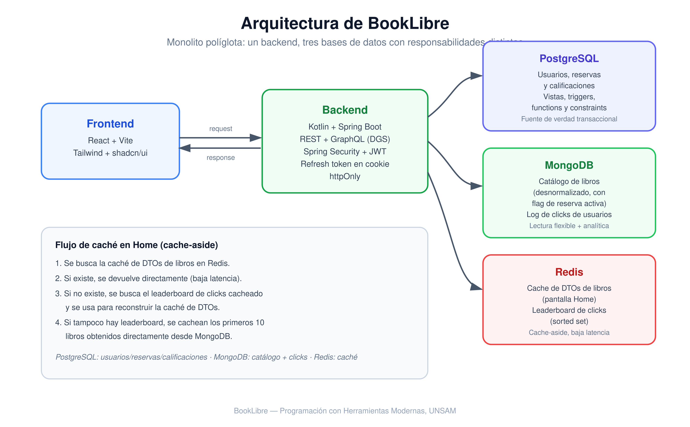
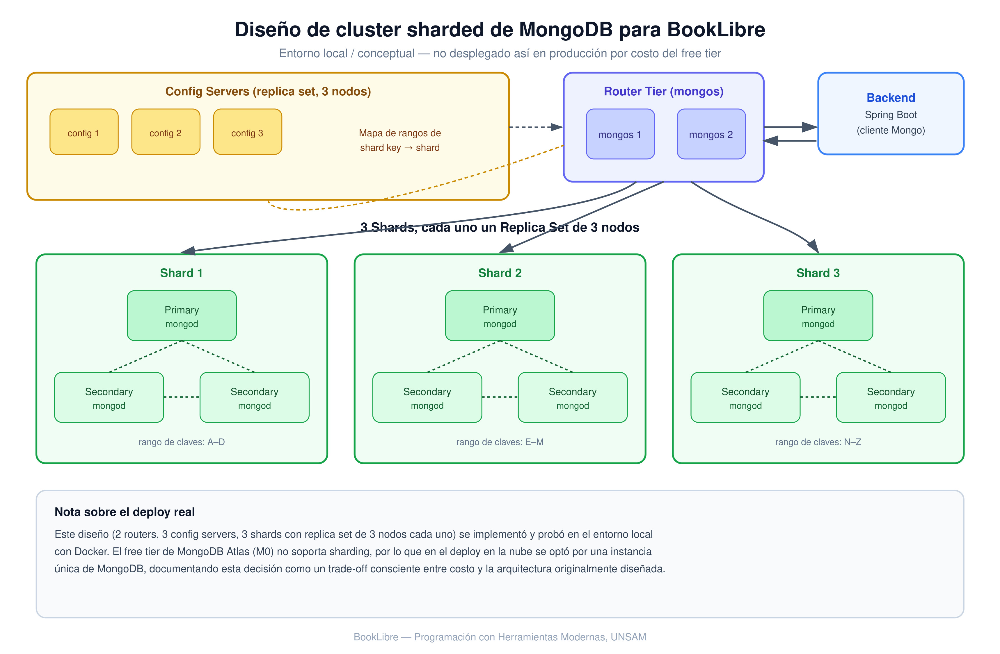

## Acerca de este repositorio

Este repositorio documenta la arquitectura, el funcionamiento y las principales decisiones técnicas del proyecto.

El código permanece privado por tratarse de un desarrollo colaborativo, por lo que este repositorio funciona como showcase del proyecto.

# 📚 BookLibre — Plataforma de Préstamo de Libros entre Usuarios

> Una aplicación para pedir, prestar y reclamar libros entre una comunidad de lectores, con un sistema de scoring (BiblioKarma) que premia la actividad de préstamo.

BookLibre es una aplicación web (desktop) para publicar libros propios, buscarlos por disponibilidad y reservarlos por rango de fechas, gestionando todo el ciclo de préstamo entre usuarios.

## Características

- Búsqueda y filtrado de libros disponibles por rango de fechas, género, ISBN y usuario prestador.
- Sistema de reservas con cálculo automático de **BiblioKarma** (puntaje de actividad lectora).
- Gestión de perfil y de los libros propios (alta, edición, estado de disponibilidad).
- Calificación y reseñas de libros una vez devueltos.
- Ranking de "Libros Populares" en tiempo real, cacheado con Redis.
- API dual: REST + GraphQL (dashboard de KPIs para un eventual administrador).
- Autenticación con JWT y autorización por rol (lector / publicador / lector-publicador).
- Persistencia poliglota: PostgreSQL, MongoDB y Redis, cada uno resolviendo un problema distinto.
- Deploy completo en la nube (Render).

## Contexto y evolución del proyecto

BookLibre fue el trabajo práctico integrador de una de las materias finales de la carreraæ, desarrollado en cuatro entregas incrementales a lo largo del cuatrimestre:

1. **Entrega 0:** dominio, interfaz de usuario (React) y backend (Kotlin + Spring Boot) con persistencia en memoria.
2. **Entrega 1:** persistencia relacional con PostgreSQL (Hibernate/JPA), autenticación JWT y autorización por rol, más componentes de base de datos (vistas, triggers, functions y constraints) para resolver reglas de negocio directamente en la capa de datos.
3. **Entrega 2:** incorporación de MongoDB como base documental para el catálogo de libros y el log de clicks de los usuarios, pensado para análisis futuro de comportamiento.
4. **Entrega 3:** capa de caché con Redis para el ranking de libros populares, una API GraphQL que convive con la REST existente para exponer un dashboard de KPIs, y el deploy del monolito políglota en la nube.

Esta progresión hace que el proyecto funcione como un caso de estudio de **por qué usar cada tipo de base de datos**, en lugar de forzar todo a una sola tecnología.

## Mi contribución

**Entrega 0 — Dominio y UI base**
- Diseño e implementación completa del flujo de **reservas y calificaciones**, tanto en frontend como en backend, incluyendo testing (crear reserva, obtener las reservas de un usuario, calificar un libro devuelto).
- Armado inicial del repositorio de frontend: estructura de carpetas y organización del proyecto, que funcionó como guía para el resto del equipo.

**Entrega 1 — Persistencia relacional y seguridad**
- Implementación completa de la configuración de seguridad: Spring Security + JWT + CORS, con un esquema de cookies y refresh tokens — el token principal se mantiene en memoria, el refresh token viaja en una cookie y se envía mediante header `Authorization` (un estándar que validé durante la investigación previa a implementarlo).
- Migración de las clases de dominio a entidades persistentes con Hibernate/JPA, continuando el desarrollo de reservas y calificaciones ya sobre la capa de persistencia real.
- Configuración de Docker y Docker Compose para levantar el entorno de desarrollo del equipo.
- Explicación al resto del grupo de las decisiones tomadas en seguridad y persistencia.

**Entrega 2 — Persistencia documental**
- Participé en la decisión de qué información migrar a MongoDB: optamos por desnormalizar el catálogo de libros, agregando un campo de reserva activa directamente en el documento. Esto evita cruzar datos con el repositorio de reservas para resolver casos como "traer todos los libros disponibles hoy" en el Home.

**Entrega 3 — Caché y deploy**
- Colaboré en el deploy de la aplicación y en la definición de la estrategia de caché junto al equipo: dos cachés independientes en Redis — una con los DTOs de libros para el Home, y otra con el leaderboard de clicks (sorted set) usado para armar el ranking de populares.
- Participé en el diseño del flujo de resolución en cascada entre ambas: se busca primero la caché de DTOs; si no está, se recurre al leaderboard cacheado para reconstruirla; si tampoco existe, se cachean los primeros 10 libros traídos directamente de MongoDB.

## Arquitectura del sistema

El sistema es un monolito políglota con una separación clara de responsabilidades por tipo de dato:

| Capa               | Tecnología                                  |
| ------------------ | -------------------------------------------- |
| Frontend            | React + Vite + Tailwind + shadcn/ui          |
| Backend             | Kotlin + Spring Boot (REST + GraphQL/DGS)    |
| Base relacional     | PostgreSQL (usuarios, reservas, transacciones) |
| Base documental     | MongoDB (catálogo de libros, log de clicks)  |
| Caché               | Redis (ranking de populares, leaderboard)    |
| Autenticación       | JWT                                          |
| Deploy              | Render (Web Service + Postgres + Key Value) + MongoDB Atlas |

    

## Decisiones técnicas

1. **Por qué PostgreSQL para el core transaccional:** usuarios, reservas y BiblioKarma requieren integridad referencial y consistencia fuerte (evitar dobles reservas, valores nulos de karma, etc.), por lo que se resolvieron varias reglas directamente en la base con constraints, triggers y vistas en lugar de solo en el backend.
2. **Por qué MongoDB para el catálogo y el log de clicks:** el catálogo de libros es un dato de lectura intensiva y con forma flexible, y el log de clicks es un caso de escritura masiva sin necesidad de transacciones — un patrón que encaja mejor con un modelo documental que con filas relacionales.
3. **Por qué Redis para el ranking:** recalcular el ranking de libros populares en cada request al Home hubiese degradado la performance de la pantalla de mayor tráfico. Se optó por un patrón cache-aside con sorted sets, actualizando el conteo en cada click y con un TTL definido para mantener la información razonablemente fresca.
4. **Por qué GraphQL además de REST:** el dashboard de KPIs necesita orquestar datos que combinan Redis, PostgreSQL y MongoDB en una sola respuesta. GraphQL permitió resolver cada métrica con su propio resolver sin sobrecargar la REST existente ni duplicar endpoints.
5. **Mongo Atlas M0 vs. cluster sharded local:** el diseño original contemplaba 2 routers, 3 config servers y 3 shards con replica set de 3 nodos cada uno (ver diagrama abajo), probado en local con Docker. El free tier de Atlas no soporta sharding, por lo que el deploy en la nube usa una instancia única, documentando esta decisión como trade-off consciente.

    

## Caso de uso principal: Ranking de libros populares (cache-aside)

1. Cada vez que un usuario hace click para ver el detalle de un libro, el backend incrementa su contador en un sorted set de Redis y registra el evento (fecha, usuario, libro) en MongoDB.
2. Al entrar al Home, el frontend pide el ranking. El backend lee primero el Top 10 desde Redis.
3. Si logra recuperar al menos 6 libros cacheados, responde con eso, priorizando latencia mínima.
4. Si no hay suficiente información en caché, se recurre a MongoDB para completar el ranking, y esa consulta vuelve a poblar la caché con el TTL definido.

## Desafíos técnicos y soluciones

### 1. Coherencia entre tres motores de datos distintos

El mayor desafío no fue usar cada base por separado, sino mantener coherencia cuando una misma operación de negocio (por ejemplo, un click) impacta en más de una: se actualiza el contador en Redis y se persiste el evento en MongoDB, sin que ninguna de las dos dependa de una transacción distribuida real. Se resolvió aceptando consistencia eventual en el log de analítica, reservando la consistencia fuerte solo para lo transaccional (PostgreSQL).

### 2. Orquestar múltiples fuentes en un solo resolver de GraphQL

El KPI de tasa de conversión requiere cruzar el Top 5 de libros más clickeados (Redis) con las reservas asociadas (PostgreSQL) en una sola respuesta. El resolver correspondiente arma primero el ranking desde Redis y luego resuelve los datos relacionales para esos libros puntuales, evitando traer de más desde Postgres.

### 3. Deploy de un monolito políglota en free tier

Desplegar cuatro piezas de infraestructura (app, PostgreSQL, Redis/Key Value y MongoDB Atlas) usando exclusivamente free tiers implicó documentar explícitamente sus límites: expiración de la base relacional a los 30 días (con script de datos versionado para recrearla), cold start del Web Service tras 15 minutos de inactividad, y la limitación de sharding en Atlas M0.

## Demostración (UI)

    
    
    

## Estado del proyecto

El proyecto fue desarrollado a lo largo de un cuatrimestre como caso de estudio de persistencia poliglota, cubriendo bases de datos relacionales, documentales y de clave-valor sobre una misma aplicación fullstack, con autenticación, autorización por rol y deploy completo en la nube.
